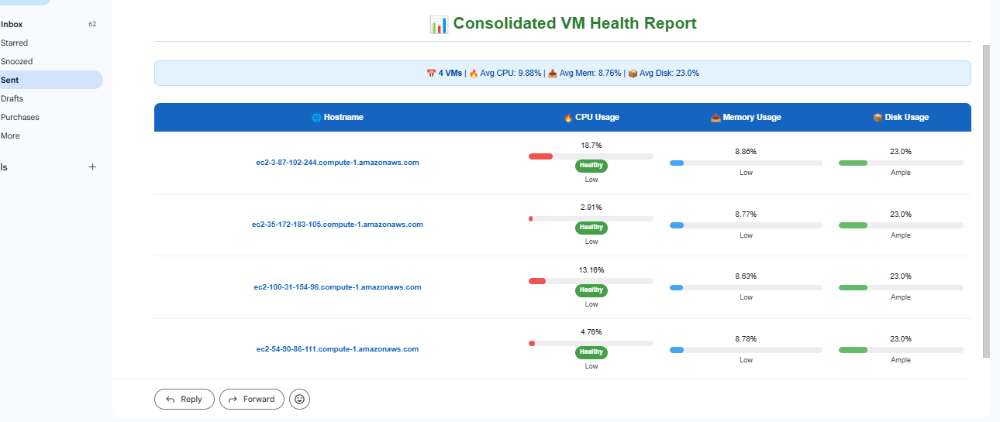

## Overview

This project focuses on monitoring virtual machines to track CPU, memory, and disk usage for each server.

It is built using **Terraform** and **Ansible**. Terraform is used to deploy and manage the infrastructure, while Ansible is responsible for collecting monitoring data from each virtual machine.

The system infrastructure consists of a single **Ansible master virtual machine**, where Ansible is installed and configured, and multiple **target virtual machines** that are being monitored. The Ansible master connects to the target VMs to gather CPU, memory, and disk usage metrics.

Once collected, the monitoring results are consolidated into a report and automatically sent via **email** in a clean and readable HTML format.


## Install Terraform

Download and install Terraform:

```bash
curl -LO https://releases.hashicorp.com/terraform/1.6.6/terraform_1.6.6_linux_amd64.zip
```
```bash
unzip terraform_1.6.6_linux_amd64.zip
```
```bash
sudo mv terraform /usr/local/bin/
```
```bash
terraform version
```
## Create an EC2 Key Pair Using AWS CLI (from CloudShell)
A key pair is required to access the virtual machines via SSH.
Run the following command to create an EC2 key pair and save the private key locally:

```bash
aws ec2 create-key-pair \
  --key-name ansible-key \
  --query 'KeyMaterial' \
  --output text > ansible-key.pem
```

## Secure the Private Key File
To ensure proper SSH access and avoid permission errors, restrict the permissions of the private key file:

```bash
chmod 400 ansible-key.pem
```

## Verify That the Key Pair Exists in AWS

Use the following command to verify that the EC2 key pair has been successfully created in AWS:

```bash
aws ec2 describe-key-pairs --key-names ansible-key
```

## Create the `modules/ec2-cluster` Directory

We create an `ec2-cluster` module so that it can be reused across the project.
Run the following command to create the directory:

```bash
mkdir -p modules/ec2-cluster
```

### Add the `variables.tf` File

We create a `variables.tf` file to define the input variables for the `ec2-cluster` module.

The following variables are defined:
- `region`: AWS region (default value is set)
- `key_name`: Name of the EC2 key pair
- `web_instance_count`: Number of EC2 instances to create (default value)
- `ami_id`: AMI ID used for the EC2 instances

Create the file with the following content:

```bash
cat > modules/ec2-cluster/variables.tf << 'EOF'
variable "region" {
  description = "AWS region"
  type        = string
  default     = "us-east-1"
}

variable "key_name" {
  description = "Name of the existing AWS key pair"
  type        = string
}

variable "web_instance_count" {
  description = "Number of web target servers"
  type        = number
  default     = 10
}

variable "ami_id" {
  description = "AMI ID for EC2 instances"
  type        = string
}
EOF
```

## Add the `main.tf` File

The `main.tf` file defines the core infrastructure of the `ec2-cluster` module.

It includes:
- The AWS provider configuration
- Retrieval of the default VPC
- A security group allowing SSH, HTTP, HTTPS, and SMTP traffic
- An EC2 instance acting as the **Ansible master**
- Multiple EC2 instances acting as **web target servers**

Create the file with the following content:

```bash
cat > modules/ec2-cluster/main.tf << 'EOF'
provider "aws" {
  region = var.region
}

############################
# Default VPC
############################
data "aws_vpc" "default" {
  default = true
}

############################
# Security Group
############################
resource "aws_security_group" "ec2_sg" {
  name        = "ansible-sg"
  description = "Security group for Ansible master and web targets"
  vpc_id      = data.aws_vpc.default.id

  ingress {
    description = "SSH"
    from_port   = 22
    to_port     = 22
    protocol    = "tcp"
    cidr_blocks = ["0.0.0.0/0"]
  }

  ingress {
    description = "HTTP"
    from_port   = 80
    to_port     = 80
    protocol    = "tcp"
    cidr_blocks = ["0.0.0.0/0"]
  }

  ingress {
    description = "HTTPS"
    from_port   = 443
    to_port     = 443
    protocol    = "tcp"
    cidr_blocks = ["0.0.0.0/0"]
  }
  
  ingress {
    description = "SMTP"
    from_port   = 587
    to_port     = 587
    protocol    = "tcp"
    cidr_blocks = ["0.0.0.0/0"]
  }

  egress {
    from_port   = 0
    to_port     = 0
    protocol    = "-1"
    cidr_blocks = ["0.0.0.0/0"]
  }

  tags = {
    Name = "ansible-security-group"
  }
}

############################
# Ansible Master
############################
resource "aws_instance" "ansible_master" {
  ami           = var.ami_id
  instance_type = "t2.medium"
  key_name      = var.key_name
  vpc_security_group_ids = [aws_security_group.ec2_sg.id]

  tags = {
    Name = "ansible-master"
  }
}

############################
# Web Target Servers
############################
resource "aws_instance" "web_targets" {
  count                  = var.web_instance_count
  ami                    = var.ami_id
  instance_type          = "t2.small"
  key_name               = var.key_name
  vpc_security_group_ids = [aws_security_group.ec2_sg.id]

  tags = {
    Name        = format("web-%02d", count.index + 1)
    Environment = "dev"
  }
}
EOF
```

## Create the Root `main.tf` to Call the `ec2-cluster` Module

This `main.tf` file is used to call the `ec2-cluster` Terraform module and define the required input variables.

Create the file with the following content:

```bash
cat > main.tf << 'EOF'
module "ec2_cluster" {
  source = "./modules/ec2-cluster"

  region             = "us-east-1"
  ami_id             = "ami-05ec1e5f7cfe5ef59" # AMI ID for ubuntu 24.04
  key_name           = "ansible-key"           # Name of the created key pair
  web_instance_count = 4                       # Number of web target servers
}
EOF
```

## Project Structure

The following tree shows the current Terraform project structure:

```text
.
├── main.tf
└── modules
    └── ec2-cluster
        ├── main.tf
        └── variables.tf
```

## Provision the Infrastructure with Terraform

Initialize the Terraform working directory:

```bash
terraform init
```
```bash
terraform plan
```
```bash
terraform apply
```
## Copy the Private Key to the Ansible Master from CloudShell

Copy the private key file to the Ansible master instance using `scp`:

```bash
scp -i ~/ansible-key.pem ~/ansible-key.pem ubuntu@<ANSIBLE_MASTER_IP>:~/ansible-key.pem
```
Then, connect to the Ansible master via SSH and secure the private key file:
```bash
ssh -i ~/ansible-key.pem ubuntu@<ANSIBLE_MASTER_IP>
```
```bash
chmod 400 ~/ansible-key.pem
```

## Install Ansible on the Ansible Master Server

Update the system packages:

```bash
sudo apt update && sudo apt upgrade -y
```
Install the required dependencies and add the Ansible repository:

```bash
sudo apt install -y software-properties-common
```
```bash
sudo add-apt-repository --yes --update ppa:ansible/ansible
```
Install Ansible:
```bash
sudo apt install -y ansible
```
```bash
ansible --version
```
Test Ansible locally:
```bash
ansible localhost -m ping
```

## Create the Ansible Inventory File

Create the inventory directory:

```bash
mkdir -p inventory
```
Create a dynamic inventory file using the official AWS EC2 Ansible plugin:
```bash
cat > inventory/aws_ec2.yaml << 'EOF'
# Dynamic AWS EC2 inventory for the Ansible project
# Official Ansible plugin used to automatically discover EC2 instances in AWS
# Filtering is based on the Environment=dev tag and running instances only

plugin: amazon.aws.aws_ec2
regions:
  - us-east-1

filters:
  "tag:Environment": dev
  instance-state-name: running

compose:
  ansible_host: public_ip_address

# Dynamic groups based on EC2 tags
keyed_groups:
  - key: tags.Name
    prefix: name
  - key: tags.Environment
    prefix: env

# SSH configuration for all instances
hostvars:
  ansible_user: ubuntu
  ansible_ssh_private_key_file: ~/ansible-key.pem
EOF
```

## Install Python3, Pip, and Boto3

Update the system and install Python 3 and Pip:

```bash
sudo apt update -y
```
```bash
sudo apt install -y python3
```
```bash
sudo apt install -y python3-pip
```
Verify the installations:
```bash
python3 --version
pip3 --version
```
Install the required AWS SDK libraries for Ansible:
```bash
pip3 install --user boto3 botocore
```
Verify that the libraries are correctly installed:
```bash
python3 -c "import boto3; import botocore; print('boto3 and botocore are OK')"
```
## Configure Ansible (`ansible.cfg`)

Create the `ansible.cfg` file to define global Ansible settings:

```bash
cat <<'EOF' > ansible.cfg
[defaults]
# Path to the Ansible inventory file (dynamic AWS EC2 inventory)
inventory = ./inventory/aws_ec2.yaml

# Explicitly define the Python interpreter to avoid compatibility issues
interpreter_python = /usr/bin/python3

# Disable SSH host key checking to prevent interactive prompts
host_key_checking = False

[ssh_connection]
# SSH options to fully disable host key verification
ssh_args = -o StrictHostKeyChecking=no -o UserKnownHostsFile=/dev/null
EOF
```

## Create an IAM Role for EC2

The Ansible master EC2 instance needs read-only access to other EC2 instances in order to discover and monitor them. For this reason, an IAM role must be attached to the Ansible master.

### Step 1: Open the IAM Console
- Log in to the AWS Management Console.
- Go to **Services → IAM → Roles**.

### Step 2: Create a New Role
- Click **Create role**.
- Under **Select trusted entity**, choose **AWS service**.
- For **Use case**, select **EC2** (since the role will be attached to an EC2 instance).
- Click **Next: Permissions**.

### Step 3: Attach the Required Policy
- In the list of policies, search for **AmazonEC2ReadOnlyAccess**.
- Select this policy.
- Click **Next: Tags** (optional).
- Click **Next: Review**.

### Step 4: Name and Create the Role
- Give the role a descriptive name, for example: `AnsibleEC2ReadOnlyRole`.
- Click **Create role**.


## Attach the IAM Role Using AWS CLI

Attach the IAM role to the Ansible master EC2 instance using the AWS CLI:

```bash
aws ec2 associate-iam-instance-profile \
  --instance-id i-00c29cd7e7d858006 \
  --iam-instance-profile Name=AnsibleEC2ReadOnlyRole
```
⚠️ Replace the instance ID with your actual Ansible master instance ID.

## Generate an SSH Public Key on the Ansible Master
Generate an SSH key pair on the Ansible master instance to allow passwordless SSH access to the target servers:
```bash
ssh-keygen -t rsa -b 4096 -C "Ansible-Master"
```

## Copy the Ansible Master Public Key to All Target VMs

To allow Ansible to connect to all target virtual machines **without requiring a password**, the public SSH key generated on the Ansible master must be copied to each VM.

By adding the Ansible master public key to the `authorized_keys` file on every target VM, Ansible can establish secure, passwordless SSH connections, which is required for automated configuration and monitoring.

Create the following script to distribute the public key to all discovered EC2 instances:

```bash
cat <<'EOF' > copy-public-key.sh
#!/bin/bash

# Private key used to access the target VMs
PEM_FILE="ansible-key.pem"

# Public key generated on the Ansible master
PUB_KEY=$(cat ~/.ssh/id_rsa.pub)

# SSH user for the EC2 instances (ubuntu for Ubuntu AMIs)
USER="ubuntu"

INVENTORY_FILE="inventory/aws_ec2.yaml"

# Extract host IPs from the dynamic Ansible inventory
HOSTS=$(ansible-inventory -i $INVENTORY_FILE --list | jq -r '._meta.hostvars | keys[]')

# Loop through all hosts and inject the public key
for HOST in $HOSTS; do
  echo "Injecting key into $HOST"
  ssh -o StrictHostKeyChecking=no -i $PEM_FILE $USER@$HOST "
    mkdir -p ~/.ssh && \
    echo \"$PUB_KEY\" >> ~/.ssh/authorized_keys && \
    chmod 700 ~/.ssh && \
    chmod 600 ~/.ssh/authorized_keys
  "
done
EOF
```

## Execute the Public Key Distribution Script

Make the script executable:

```bash
sudo chmod +x copy-public-key.sh
```
Run the script to copy the Ansible master public key to all target virtual machines:
```bash
./copy-public-key.sh
```

## Install `jq`

The `copy-public-key.sh` script requires `jq` to parse the JSON output of the Ansible dynamic inventory.  
If `jq` is not already installed, install it using the following command:

```bash
sudo apt install -y jq
```

## Test Ansible Connectivity

Use the following command to verify that Ansible can successfully connect to all target virtual machines:

```bash
ansible all -m ping
```
## Organize Ansible Files into the `vm-monitor` Directory

To keep the project well organized, all Ansible-related files are grouped into a dedicated directory named `vm-monitor`.

Create the directory and move into it:

```bash
mkdir vm-monitor
cd vm-monitor
```
## Copy Ansible Configuration Files into `vm-monitor`
Copy the Ansible configuration file into the `vm-monitor` directory:

```bash
cp /home/ubuntu/ansible.cfg .
```
Copy the inventory directory into vm-monitor:
```bash
cp -r /home/ubuntu/inventory/ .
```

## Create Global Ansible Variables (`group_vars`)

The `group_vars` directory is used to define variables that apply to all managed hosts.  
In this project, it stores SMTP and email configuration settings used for alerting and notifications.

Create the `group_vars` directory:

```bash
mkdir group_vars
```

```bash
cat <<'EOF' > group_vars/all.yml

# SMTP server configuration
smtp_server: "smtp.gmail.com"
smtp_port: 587

# Email credentials (replace with real values or use Ansible Vault)
email_user: "--"
email_pass: "--"

# Email address that will receive monitoring alerts
alert_recipient: "--"
EOF
```

## Create a Gmail App Password for Email Notifications

To automate email notifications using Ansible, a Gmail **App Password** is required.

### Step 1: Enable Two-Factor Authentication
Make sure **Two-Factor Authentication (2FA)** is enabled on your Gmail account.  
This is mandatory in order to create an app password.

### Step 2: Create an App Password
- Go to **https://myaccount.google.com/apppasswords**
- Sign in to your Google account.
- Create a new app password and give it a descriptive name (for example: `Ansible-Mail`).
- Gmail will automatically generate an app password.

### Step 3: Configure Ansible
Copy the generated app password and update the following variable in `group_vars/all.yml`:

```yaml
email_pass: "<YOUR_APP_PASSWORD>"
```

## Ansible Playbooks for VM Monitoring and Reporting

This project uses three Ansible playbooks to collect system metrics from virtual machines and send a consolidated email report.

### 1️⃣ `collect_metrics.yml`

This playbook is executed on all target virtual machines (`env_dev` group).  
Its purpose is to collect CPU, memory, and disk usage metrics from each VM.

**Key actions performed:**
- Installs the `sysstat` package (required for `mpstat`)
  - Uses `apt` for Debian-based systems
  - Uses `yum` for RedHat-based systems
- Collects:
  - **CPU usage** using `mpstat`
  - **Memory usage** using `free`
  - **Disk usage** using `df`
- Stores the collected metrics as Ansible facts (`vm_metrics`) for later use

Each VM reports the following data:
- Hostname
- CPU usage (%)
- Memory usage (%)
- Disk usage (%)

```yaml
cat <<'EOF' > collect_metrics.yml
- name: Collect VM metrics
  hosts: env_dev
  become: true
  gather_facts: true
  tasks:

    - name: Install sysstat (for mpstat)
      apt:
        name: sysstat
        state: present
      when: ansible_os_family == "Debian"

    - name: Install sysstat (RedHat/CentOS)
      yum:
        name: sysstat
        state: present
      when: ansible_os_family == "RedHat"

    - name: Get CPU usage via mpstat
      shell: "mpstat 1 1 | awk '/Average/ && $NF ~ /[0-9.]+/ {print 100 - $NF}'"
      register: cpu_usage

    - name: Get memory usage
      shell: "free | awk '/Mem/{printf(\"%.2f\", $3/$2 * 100.0)}'"
      register: mem_usage

    - name: Get disk usage
      shell: "df / | awk 'NR==2 {print $5}' | tr -d '%'"
      register: disk_usage

    - name: Set metrics fact
      set_fact:
        vm_metrics:
          hostname: "{{ inventory_hostname }}"
          cpu: "{{ cpu_usage.stdout | float | round(2) }}"
          mem: "{{ mem_usage.stdout | float | round(2) }}"
          disk: "{{ disk_usage.stdout | float | round(2) }}"
EOF
```

### 2️⃣ `send_report.yml`

This playbook runs **locally on the Ansible master** (`localhost`).

**Its purpose is to:**
- Aggregate metrics collected from all target VMs using `hostvars`
- Build a consolidated report
- Send an **HTML email report** using SMTP

**Key features:**
- Collects all `vm_metrics` facts from managed hosts
- Generates a timestamped email subject
- Sends an animated HTML report using a Jinja2 template:
  - `templates/report_email_animated.html.j2`
- Uses SMTP credentials defined in `group_vars/all.yml`

```yaml
- import_playbook: collect_metrics.yml
- import_playbook: send_report.yml


```yaml
cat <<'EOF' > send_report.yml
- name: Send consolidated VM report
  hosts: localhost
  gather_facts: true
  vars:
    collected_metrics: >-
      {{
        hostvars |
        dict2items |
        selectattr('value.vm_metrics', 'defined') |
        map(attribute='value.vm_metrics') |
        list
      }}
    timestamp: "{{ ansible_date_time.date }} {{ ansible_date_time.time }}"
    subject_line: "📊 VM Report – {{ ansible_date_time.date }} {{ ansible_date_time.hour }}:{{ ansible_date_time.minute }}"
  tasks:
    - name: Send animated HTML report via email
      mail:
        host: "{{ smtp_server }}"
        port: "{{ smtp_port }}"
        username: "{{ email_user }}"
        password: "{{ email_pass }}"
        to: "{{ alert_recipient }}"
        subject: "{{ subject_line }}"
        body: "{{ lookup('template', 'templates/report_email_animated.html.j2') }}"
        subtype: html

EOF
```

### 3️⃣ `playbook.yml`

This is the **main orchestration playbook**.

It simply executes the monitoring workflow in the correct order:
1. Collect metrics from all VMs
2. Send a consolidated email report

```yaml
cat <<'EOF' > playbook.yml
- import_playbook: collect_metrics.yml
- import_playbook: send_report.yml
EOF
```

## Email Report Template (Jinja2)

This project uses a Jinja2 HTML template to generate a **rich, animated email report** summarizing the health of all monitored virtual machines.

### Template Location

Create the templates directory:
```bash
mkdir templates
```
```yaml
cat <<'EOF' > templates/report_email_animated.html.j2
<!DOCTYPE html>
<html>
<head>
  <meta charset="UTF-8">
  <style>
    body {
      font-family: 'Segoe UI', sans-serif;
      background-color: #f9fbfc;
      padding: 32px;
      color: #333;
      max-width: 960px;
      margin: auto;
    }

    h2 {
      text-align: center;
      color: #2e7d32;
      font-size: 28px;
      margin-bottom: 32px;
      border-bottom: 2px solid #c8e6c9;
      padding-bottom: 10px;
    }

    .summary {
      text-align: center;
      margin-bottom: 30px;
      background-color: #e3f2fd;
      border: 1px solid #bbdefb;
      padding: 10px 18px;
      border-radius: 8px;
      font-size: 14px;
      color: #0d47a1;
    }

    table {
      width: 100%;
      border-collapse: collapse;
      box-shadow: 0 4px 12px rgba(0,0,0,0.08);
      background-color: #ffffff;
      border-radius: 10px;
      overflow: hidden;
    }

    th {
      background-color: #1565c0;
      color: white;
      padding: 14px;
      font-size: 14px;
      text-align: center;
    }

    td {
      padding: 14px;
      font-size: 13px;
      text-align: center;
      border-bottom: 1px solid #f0f0f0;
    }

    tr:hover td {
      background-color: #f5faff;
    }

    .hostname a {
      color: #1565c0;
      text-decoration: none;
      font-weight: bold;
    }

    .bar-container {
      width: 100%;
      background-color: #eee;
      border-radius: 6px;
      height: 10px;
      overflow: hidden;
      margin-top: 4px;
    }

    .bar {
      height: 100%;
      border-radius: 6px;
    }

    .cpu-bar { background-color: #ef5350; }
    .mem-bar { background-color: #42a5f5; }
    .disk-bar { background-color: #66bb6a; }

    .label {
      margin-top: 4px;
      font-size: 12px;
      color: #555;
    }

    .badge {
      font-size: 11px;
      padding: 3px 8px;
      border-radius: 12px;
      display: inline-block;
      font-weight: 600;
      color: #fff;
    }

    .healthy { background-color: #43a047; }
    .warning { background-color: #fbc02d; color: #000; }
    .critical { background-color: #d32f2f; }

    .footer {
      text-align: center;
      font-size: 12px;
      margin-top: 24px;
      color: #666;
    }
  </style>
</head>
<body>
  <h2>📊 Consolidated VM Health Report</h2>

  <div class="summary">
    📅 <b>{{ collected_metrics | length }} VMs</b> | 🔥 Avg CPU: {{ ((collected_metrics | map(attribute='cpu') | map('float') | sum | float) / (collected_metrics | length)) | round(2) }}% | 📥 Avg Mem: {{ ((collected_metrics | map(attribute='mem') | map('float') | sum | float) / (collected_metrics | length)) | round(2) }}% | 📦 Avg Disk: {{ ((collected_metrics | map(attribute='disk') | map('float') | sum | float) / (collected_metrics | length)) | round(2) }}%
  </div>

  <table>
    <tr>
      <th>🌐 Hostname</th>
      <th>🔥 CPU Usage</th>
      <th>📥 Memory Usage</th>
      <th>📦 Disk Usage</th>
    </tr>
    
    <tr>
      <td class="hostname">
        <a href="http://{{ vm.hostname }}" target="_blank">{{ vm.hostname }}</a>
      </td>
      <td>
        {{ vm.cpu }}%
        <div class="bar-container"><div class="bar cpu-bar" style="width: {{ vm.cpu }}%"></div></div>
        
          <div class="badge healthy">Healthy</div>
          <div class="label">Low</div>
        
          <div class="badge warning">Warning</div>
          <div class="label">Moderate</div>
        
          <div class="badge critical">Critical</div>
          <div class="label">High</div>
        
      </td>
      <td>
        {{ vm.mem }}%
        <div class="bar-container"><div class="bar mem-bar" style="width: {{ vm.mem }}%"></div></div>
        <div class="label">Low</div>
        <div class="label">Moderate</div>
        <div class="label">High</div>
      </td>
      <td>
        {{ vm.disk }}%
        <div class="bar-container"><div class="bar disk-bar" style="width: {{ vm.disk }}%"></div></div>
        <div class="label">Ample</div>
        <div class="label">Monitor</div>
        <div class="label">Full</div>
      </td>
    </tr>
    
  </table>

  <div class="footer">
    ⏱️ Report Generated on: {{ timestamp }}
  </div>
</body>
</html>

EOF
```

### Template Purpose

This template is used by the `send_report.yml` playbook to:

- Display a consolidated view of all monitored VMs
- Visualize CPU, memory, and disk usage
- Highlight system health using colors, progress bars, and status badges
- Send a clean and readable HTML email report

## Ansible Project Structure (`vm-monitor`)

The following tree shows the structure of the Ansible monitoring project:

```text
vm-monitor/
├── ansible.cfg
├── collect_metrics.yml
├── send_report.yml
├── playbook.yml
├── copy-public-key.sh
├── inventory/
│   └── aws_ec2.yaml
├── group_vars/
│   └── all.yml
└── templates/
    └── report_email_animated.html.j2
```

## Run the Monitoring Playbook

Once all configurations are complete, you can execute the Ansible playbook to start the monitoring workflow.

Run the following command from the `vm-monitor` directory:

```bash
ansible-playbook playbook.yml
```

## 📧 Final Email Report Result

Below is an example of the final HTML email report generated by Ansible and sent automatically after collecting VM metrics (CPU, memory, and disk usage):




